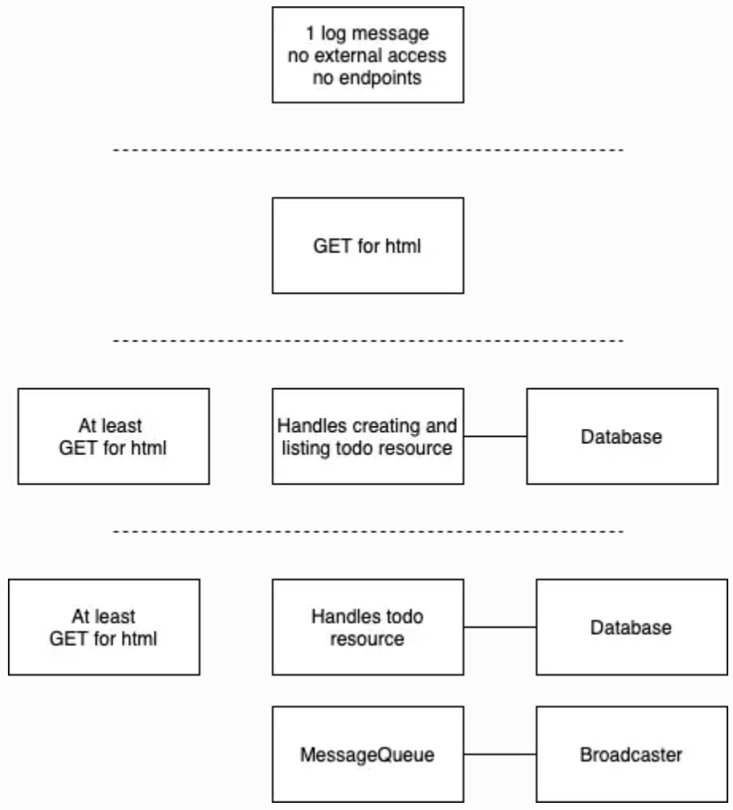

# 1.2 The Project, Step 1
The course project is a simple todo application with the familiar features of create, read, update, and delete (CRUD). Todo is a text like "I need to clean the house" that can be in the state of not-done or done.

## Instructions
Create a web server that outputs "Server started in port NNNN" when it is started and deploy it into your Kubernetes cluster. Please make it so that an environment variable PORT can be used to choose the used port. You may call the server todo app since it will, amongst other things, provide the functionality of a todo application pretty soon.

You will not have access to the port when it is running in Kubernetes yet. We will configure the access when we get to networking.

## Solution
```
# Build the Docker image 
docker build -t paulajuliabalza/todo-app:1.0 .

# Push image to Docker Hub Repository
docker push paulajuliabalza/todo-app:1.0

# Deploy to Kubernetes
kubectl create deployment todo-app --image=paulajuliabalza/todo-app:1.0 --port=3000
deployment.apps/todo-app created

# Get pods
kubectl get pods
NAME                        READY   STATUS    RESTARTS   AGE
todo-app-7b5b7df79b-6cb5b   1/1     Running   0          65s

# Get Logs
kubectl logs todo-app-7b5b7df79b-6cb5b
Server started in port 3000
[2025-06-26T23:32:23.375Z] Todo App heartbeat on port 3000
[2025-06-26T23:32:28.379Z] Todo App heartbeat on port 3000
[2025-06-26T23:32:33.383Z] Todo App heartbeat on port 3000
[2025-06-26T23:32:38.388Z] Todo App heartbeat on port 3000

# Cleanup
kubectl delete deployment todo-app
```

# 1.4: The project, step 2

## Instructions
Create a deployment.yaml for the course project (that you started in Exercise 1.2.)

You won't have access to the port yet but that'll come soon.

## Solution
```
# Apply manifest
kubectl apply -f manifests/deployment-todoapp.yaml
deployment.apps/todo-app created

```

# 1.5: The project, step 3

## Instructions
Make the project respond something to a GET request sent to the / url of the project. A simple HTML page is good, or you can deploy something more complex, like a single-page application.

Define Environment Variables for a Container
https://kubernetes.io/docs/tasks/inject-data-application/define-environment-variable-container/ 

Use kubectl port-forward to confirm that the project is accessible and works in the cluster by using a browser to access the project.

## Solution
```
# Build Docker Image
docker build -t paulajuliabalza/todo-app:1.5 .

# Push the image to Docker Hub
docker push paulajuliabalza/todo-app:1.5

# Apply the deployment
kubectl apply -f course_project/manifests/deployment-todoapp.yaml
deployment.apps/todo-app configured

# Get pods
kubectl get pos
todo-app-7bfbdb5f99-lwbv8    1/1     Running   0              86s

# Get Logs
kubectl logs todo-app-7bfbdb5f99-lwbv8
Server started in port 3000
[2025-06-27T13:35:26.655Z] Todo App heartbeat on port 3000
[2025-06-27T13:35:31.659Z] Todo App heartbeat on port 3000
[2025-06-27T13:35:36.663Z] Todo App heartbeat on port 3000


# Port Forward to access the application
kubectl port-forward deployment/todo-app 8080:3000
Forwarding from 127.0.0.1:8080 -> 3000
Forwarding from [::1]:8080 -> 3000

# Access the application
Open your browser and go to http://localhost:8080 
curl http://localhost:8080

      <!DOCTYPE html>
      <html>
        <head>
          <title>Todo App</title>
        </head>
        <body>
          <h1>Todo App</h1>
          <p>This is a simple todo application.</p>
        </body>
      </html>


# List pod env vars
kubectl exec <pod-name> -- printenv
kubectl exec todo-app-7bfbdb5f99-lwbv8 -- printenv
PATH=/usr/local/sbin:/usr/local/bin:/usr/sbin:/usr/bin:/sbin:/bin
HOSTNAME=todo-app-7bfbdb5f99-lwbv8
NODE_VERSION=18.20.8
YARN_VERSION=1.22.22
PORT=3000
KUBERNETES_SERVICE_PORT=443
KUBERNETES_SERVICE_PORT_HTTPS=443
KUBERNETES_PORT=tcp://10.43.0.1:443
KUBERNETES_PORT_443_TCP=tcp://10.43.0.1:443
KUBERNETES_PORT_443_TCP_PROTO=tcp
KUBERNETES_PORT_443_TCP_PORT=443
KUBERNETES_PORT_443_TCP_ADDR=10.43.0.1
KUBERNETES_SERVICE_HOST=10.43.0.1
HOME=/root

```

# 1.6: The project, step 4

## Instructions
Use a NodePort Service to enable access to the project.

## Solution
```
# Create k3d Cluster mapping port 30080 from agent-0 to localhost:8082
https://github.com/k3d-io/k3d/blob/main/docs/usage/exposing_services.md
k3d cluster create mycluster -p "8082:30080@agent:0" --agents 2
k3d kubeconfig merge mycluster --kubeconfig-merge-default
kubectl cluster-info
kubectl cluster-info dump

# Docker containers k3d Infra
docker ps
CONTAINER ID   IMAGE                            COMMAND                  CREATED         STATUS         PORTS                                                                          NAMES
94701af55c51   ghcr.io/k3d-io/k3d-proxy:5.4.1   "/bin/sh -c nginx-pr…"   3 minutes ago   Up 2 minutes   80/tcp, 0.0.0.0:38247->6443/tcp, 0.0.0.0:8082->30080/tcp, :::8082->30080/tcp   k3d-mycluster-serverlb
2470f6d26173   rancher/k3s:v1.22.7-k3s1         "/bin/k3s agent"         3 minutes ago   Up 3 minutes                                                                                  k3d-mycluster-agent-1
74190fa2be6d   rancher/k3s:v1.22.7-k3s1         "/bin/k3s agent"         3 minutes ago   Up 3 minutes                                                                                  k3d-mycluster-agent-0
3350b8289dcb   rancher/k3s:v1.22.7-k3s1         "/bin/k3s server --t…"   3 minutes ago   Up 3 minutes                                                                                  k3d-mycluster-server-0

# Apply manifest
kubectl apply -f manifests/deployment-todoapp.yaml
deployment.apps/todo-app created

# Apply the NodePort Service (port range 30000-32767)
# Docker creates iptable entries and a new proxy process per port-mapping
kubectl apply -f course_project/manifests/service-todoapp.yaml
service/todo-app-service created

# Get svc
kubectl get svc
NAME               TYPE        CLUSTER-IP      EXTERNAL-IP   PORT(S)          AGE
kubernetes         ClusterIP   10.43.0.1       <none>        443/TCP          6m18s
todo-app-service   NodePort    10.43.223.131   <none>        3000:30080/TCP   49s

# Get pods
kubectl get po
NAME                        READY   STATUS    RESTARTS   AGE
todo-app-7bfbdb5f99-gnt7r   1/1     Running   0          88s

# Get Deployment
kubectl get deployment
NAME       READY   UP-TO-DATE   AVAILABLE   AGE
todo-app   1/1     1            1           104s

# Get ReplicaSet
kubectl get rs
NAME                  DESIRED   CURRENT   READY   AGE
todo-app-7bfbdb5f99   1         1         1       2m12s

# Access todoapp
curl localhost:8082/

      <!DOCTYPE html>
      <html>
        <head>
          <title>Todo App</title>
        </head>
        <body>
          <h1>Todo App</h1>
          <p>This is a simple todo application.</p>
        </body>
      </html>

```
